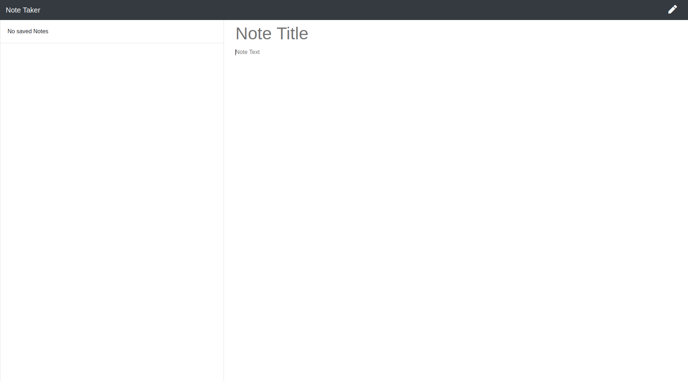

# Keeper

<span align="center">

[](https://github.com/davidsaulrodriguez/keeper/issues)
[](https://github.com/davidsaulrodriguez/keeper/network)
[](https://github.com/davidsaulrodriguez/keeper/stargazers)
[](https://github.com/davidsaulrodriguez/keeper)


[](https://sonarcloud.io/dashboard?id=davidsaulrodriguez_keeper)
[](https://sonarcloud.io/dashboard?id=davidsaulrodriguez_keeper)
[](https://sonarcloud.io/dashboard?id=davidsaulrodriguez_keeper)
[](https://sonarcloud.io/dashboard?id=davidsaulrodriguez_keeper)

</span>

## Table of Contents

- [Description](#description)
- [Screenshot](#screenshots)
- [Dependencies](#dependencies)
- [Installation](#installation)
- [Usage](#usage)
- [Contributing](#contributing)
- [Bugs and Issues](#bugs-and-issues)
- [License](#license)

## Description

A note taking application that is built using NodeJS and Express and uses Bootstrap 4 as its CSS framework.

## Screenshots

**Keeper's Main Index Page**
**Keeper - Empty Database View**
**Keeper - Create Note View**
**Keeper - Saved Notes View**

## Dependencies

**Project Dependencies**

- "bootstrap": ^4.6.0
- "del": ^6.0.0
- "express": ^4.17.1
- "gulp": ^4.0.2
- "gulp-autoprefixer": ^7.0.1
- "gulp-live-server": 0.0.31
- "gulp-minify": ^3.1.0
- "gulp-rename": ^2.0.0
- "gulp-sass": ^4.1.0
- "gulp-sourcemaps": ^3.0.0
- "jquery": ^3.5.1
- "popper.js": ^1.16.1

## Installation

### Requirements

You will need the Node.js Package Manager (npm) for use with this project.

- [Node.js][nodejs] and ```npm```

### Install

Download the zip or clone this project.

```shell
git clone https://github.com/davidsaulrodriguez/keeper.git
cd keeper/
```

Now install the required dependencies with npm.

```shell
npm install
```

## Usage

### Development

All source code development happens in the `src` folder. You can make your changes in the source folder and then compile them by running

```shell
npm run build
```

After running `npm run build` it will output a `public/` folder with all of your source files compiled.You can then start the live server and in your browser of choice go to `http://localhost:3000` after running:

```shell
npm run start
```

### Deployment

See the development steps above. They are the exact steps required to deploy the application into production.

If you are deploying to Heroku, there are already scripts in the `package.json` file to build the app and deploy it automatically on the platform.

## Contributing

Contributions are more than welcome! If you improve on this project skeleton, please feel free to share it by submitting a Pull Request.

Before contributing, be sure to check out the [CONTRIBUTING][contrib] file.

## Bugs and Issues

Found a bug? Having an issue with this app? [Open a new issue][issues] here.

## License

This project and all of its source code is released and permissively licensed under the [BSD 2 Clause][license] license.

[ssone]: #
[nodejs]: https://nodejs.com
[contrib]: ./CONTRIBUTING.md
[issues]: https://github.com/davidsaulrodriguez/keeper/issues
[license]: ./LICENSE